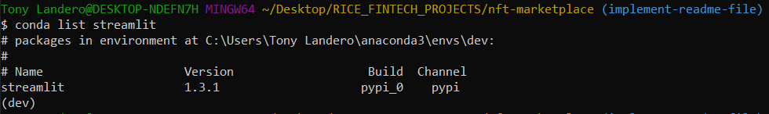
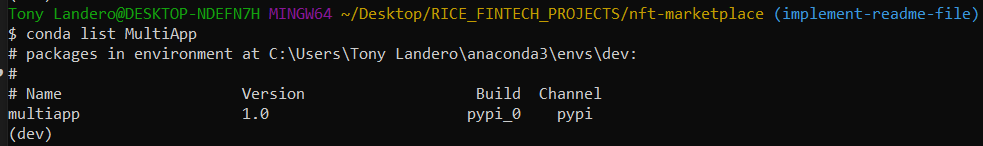
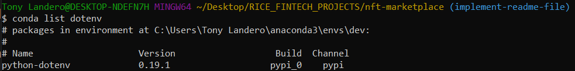
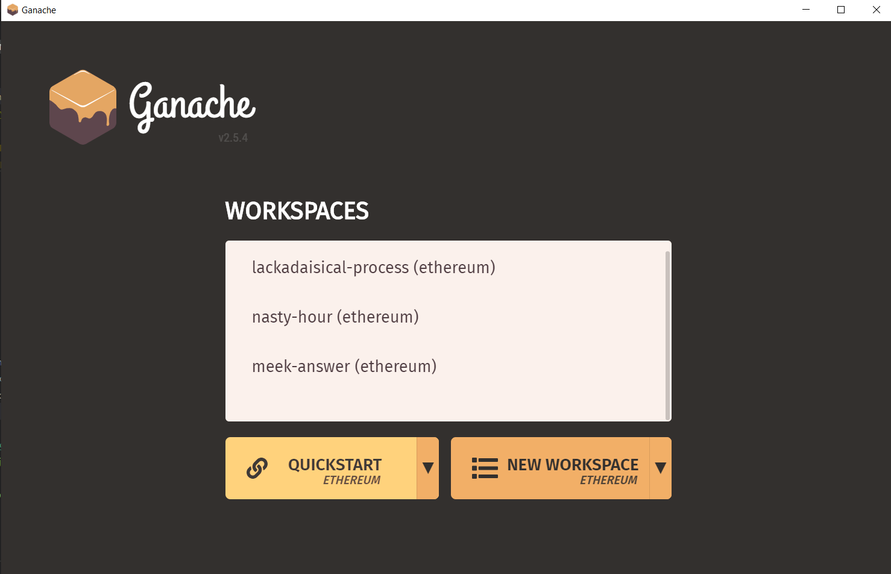
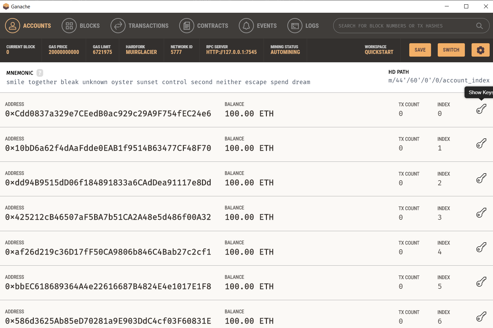
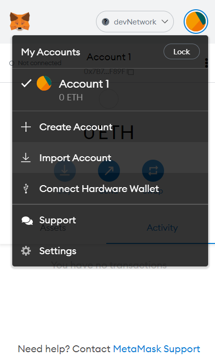
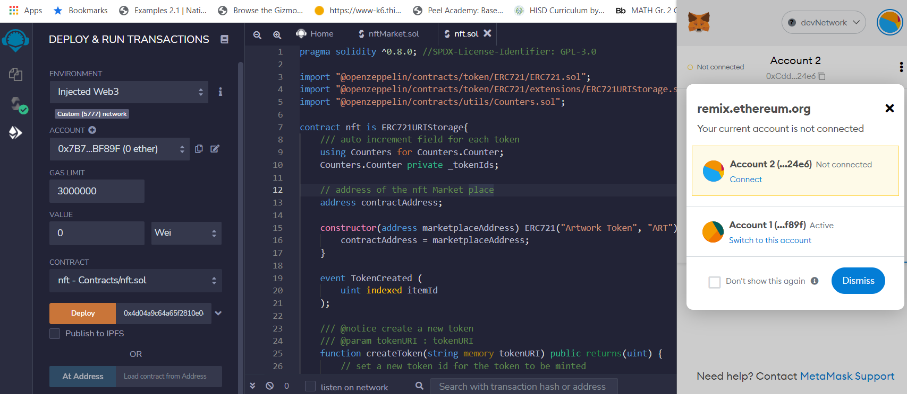
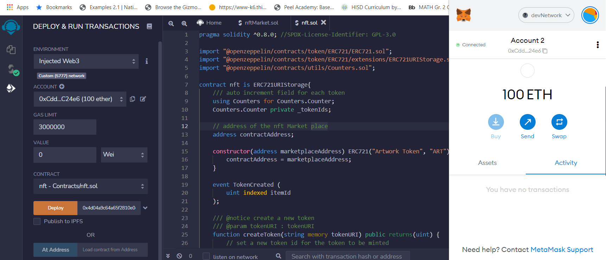

# nft-marketplace
Creators around the world have a need to both mint their art as NFTs and have a means to sell them. This demonstration will include a simplified NFT MarketPlace that tests the concepts behind minting NFTs; transferring NFTs governed by time-based consignment smart contracts; and managing sale, commission, and transfer of NFTs.

---

## Technologies

This project leverages python 3.7 and solidity 0.8.0 with the following packages:

**[Streamlit Library](https://docs.streamlit.io/)** - Streamlit is an open-source Python library that makes it easy to create and share beautiful, custom web apps for machine learning and data science. 

**[MultiApp Library](https://pypi.org/project/MultiApp/)** - MultiApp is a framework so that you can give your applications a quick and easy way to have multiple functions at the command line.

**[OS Library](https://docs.python.org/3/library/os.html)** - This module provides a portable way of using operating system dependent functionality.

**[dotenv Library](https://pypi.org/project/python-dotenv/)** - Python-dotenv reads key-value pairs from a `.env` file and can set them as environment variables.

**[Pinata API](https://docs.pinata.cloud/api-pinning/pinning-services-api)** - The Pinning Services API spec is a standardized specification for developers building on top of IPFS that allows an application to integrate a pinning service without needing to learn that pinning service's unique API.

---

## Installation Guide

Before running the application first install the following dependencies:

First, we'll verify that we have streamlit installed in our environment.

Copy the following command in your terminal:

`conda list streamlit`

If installed, you should be able to see the version number as the following image shows:

If Streamlit is not installed, we can do so through our terminal. Paste the following code:

`pip install streamlit`

Once the installation is complete, run the `conda list streamlit` command to verify the version.

Next, we'll verify that we have MultiApp installed in our environment.

Copy the following command in your terminal:

`conda list MultiApp`

If installed, you should be able to see the version number as the following image shows:

Once the installation is complete, run the `conda list MultiApp` command to verify the version.

Great! Now we'll verify that we have dotenv installed in our environment.

Copy the following command in your terminal:

`conda list dotenv`

If installed, you should be able to see the version number as the following image shows:

Once the installation is complete, run the `conda list dotenv` command to verify the version.

We have verified and/or installed the dependencies we need to run our application. However, we have 2 more steps to complete before we can begin working on our files.

Pinata - Register for your API Keys

IPFS - Optionally, install the IPFS Browser Extension

Let's begin with Pinata:

1. Go to the **[Pinata Website](https://www.pinata.cloud/)**.

  **Important Note** - The descriptions of the Pinata user interface reflect how it exists at the time of this writing. However, you might find slight differences because of updates.

2. Click the Sign Up button, and then sign up for a free account. If you already have an account, click the Login button, and then log in to the Pinata dashboard.

  **Important Note** - Pinata accounts are free and allow you to pin files up to a total of 1 gigabyte in IPFS.

3. Go to the **[Pinata documentation page](https://docs.pinata.cloud/)**, and then follow the instructions to generate your Pinata API key and API secret key.

  **Important Note** - Make sure to click the option to grant Admin privileges for your keys.

You should now have your Pinata API keys. Make sure you save them in a private area and have them ready for use. 

Let's finish by installing the IPFS Browser Extension:

If you’d like the ability to display IPFS links directly in the browser in addition to displaying them on the Pinata website, you can install a web browser extension. With the extension, you’ll be able to connect directly to IPFS links. To do this, go to the **[IPFS Companion](https://github.com/ipfs/ipfs-companion#install-ipfs-companion)** GitHub repository, and then follow the installation steps for your browser.

We are now done with all of the installations we need to run our application. 

---

## Usage Guide

We need to begin with our connections to Ganache and MetaMask. We will be using Ganache as our test blockchain and MetaMask as our EOA (Externally Owned Account). We use MetaMask for its decentralized nature. 

Open a new instance of Ganache and select `QUICKSTART` as the following image shows:

We now need to connect Ganache to MetaMask. 

We do so by clicking on the key icon to the right of each Ganache account:

Copy the private key, and then in MetaMask, click on `Import Account`:

Then, paste the private key you copied from the Ganache account:

Now we have Ganache and MataMask connected. The last connection we need to make is MetaMask to the Remix IDE, where our contracts reside.

We open Remix IDE, verify that our deployer is Injected Web3. We also open MetaMask and a connection request will appear:

There are 2 main ways to verify if Remix is connected to MetaMask:

First, below the MetaMask logo, you will see a green dot that says `connected`. Additionally, we know we are connected to Ganache, and Remix because you can see the balance of the account as 100 ETH. You can also see this balance in the `Account` field in the Remix sidebar. 

Congratulations! You have all the required connections to run the application. 